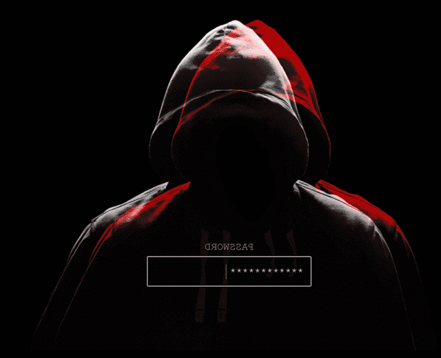

  

 

# 👋 Hola, soy Armin

 

Estudiante de **Ingeniería en Sistemas** interesado principalmente en  
**Ciberseguridad, Redes, Bases de Datos y Desarrollo Backend**.

📍 Guatemala

  

---

## 👨‍💻 Sobre mí

🔐 Interesado principalmente en **Ciberseguridad y Seguridad Web**  
🌐 Conocimientos de **Networking, Subnetting y VLSM**  
🗄️ Interés en **Bases de Datos y seguridad de la información**  
🐧 Aprendiendo y trabajando con **Linux**  
⚙️ Desarrollo Backend con **Java y Spring Boot**  
🐳 Uso de **Docker** para entornos de desarrollo  
🔄 Manejo de **Git y GitHub**  
🧪 Testing, debugging y análisis de errores  
🚩 Práctica mediante laboratorios de **Hack The Box**

---

## 🔐 Cybersecurity

  

`Web Security` • `OWASP` • `SQL Injection` • `Authentication`

`Authorization` • `Access Control` • `Vulnerability Analysis`

`Network Security` • `Database Security` • `Secure Development`

---

## 🌐 Networking

  

`IPv4` • `Subnetting` • `VLSM` • `Routing`

`Routers` • `Switches` • `VPCS` • `DNS`

`FastEthernet` • `Serial Interfaces` • `LAN` • `Network Troubleshooting`

---

## ⚙️ Backend & Databases

  

---

## 🛠️ Tecnologías

  

---

## 🧰 Herramientas

---

## 🧠 Áreas de interés

  

`Cybersecurity` • `Ethical Hacking` • `Web Security`

`Network Security` • `Database Security`

`Backend Development` • `Linux` • `Secure Software Development`

---

## 🕹️ Pac-Man Contributions

<picture>
  <source
    media="(prefers-color-scheme: dark)"
    srcset="https://raw.githubusercontent.com/Arminfx7/Arminfx7/output/pacman-contribution-graph-dark.svg">
  <source
    media="(prefers-color-scheme: light)"
    srcset="https://raw.githubusercontent.com/Arminfx7/Arminfx7/output/pacman-contribution-graph.svg">
  
</picture>

---

## 🖥️ Current Focus

---

## 🎯 Actualmente aprendiendo

---

## 📫 Contacto

---

### 🔐 Secure • Analyze • Learn • Build

 

⭐ Gracias por visitar mi perfil

